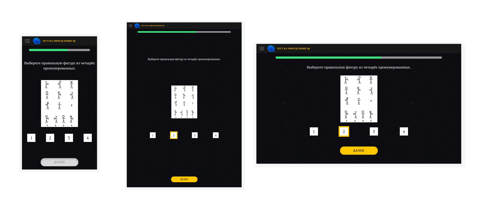

# Веб-приложение тестирования IQ

Приложение на Vue 3. Отвечайте на вопросы, читайте информацию, ответы сохраняются, но сервера все равно нет.

### Данное приложение реализует:
* работу с vuex store
* кастомные директивы
* миксины и глобальная регистрация компонентов
* less-стили

## Корректная работа при любом размере



### Макет 

https://www.figma.com/file/mTNXbFPzU5vaAOlEp0np7d/%D0%A2%D0%B5%D1%81%D1%82-%D0%BD%D0%B0-%D1%83%D1%80%D0%BE%D0%B2%D0%B5%D0%BD%D1%8C-IQ?node-id=0%3A1

# Установка
```
npm install
```

### Компиляция и перезагрузка
```
npm run serve
```

### Компиляция и минимизация для сборки
```
npm run build
```

### Файлы линтов и исправлений
```
npm run lint
```

### Кастомная конфигурация
Смотрите [Configuration Reference](https://cli.vuejs.org/config/).

## Список конечных точек:

```javascript
const routes = [
  {
    path: '/home',
    name: 'Home',
    component: Home
  },
  {
    path: '/test/page/:id',
    name: 'TestForm',
    component: () => import('../views/TestForm.vue')
  },
  {
    path: '/test/loading/',
    name: 'LoadingPage',
    component: LoadingPage
  },
  {
    path: '/test/result',
    name: 'ResultPage',
    component: ResultPage
  },
  {
    path: '/',
    redirect: {name: 'Home'}
  }
]

```